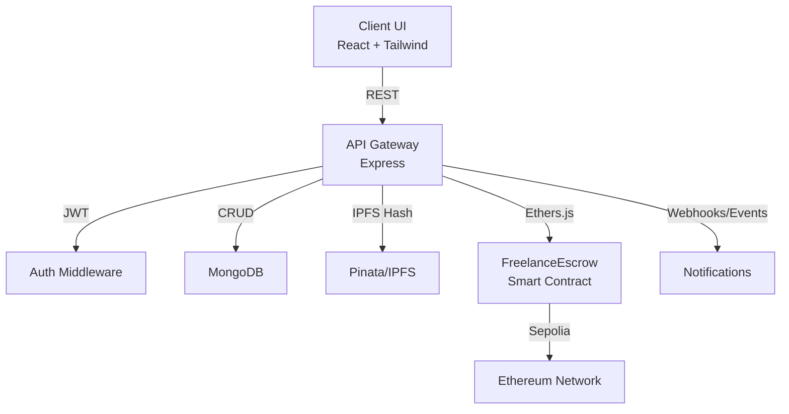

# ChainEscrow Architecture

Flow:
- UI calls backend APIs with JWT; MetaMask signs blockchain actions.
- Backend writes business state to MongoDB and hashes/proofs to IPFS.
- On-chain contract manages escrowed ETH and milestone payouts.
- Events feed transaction history and notifications.
